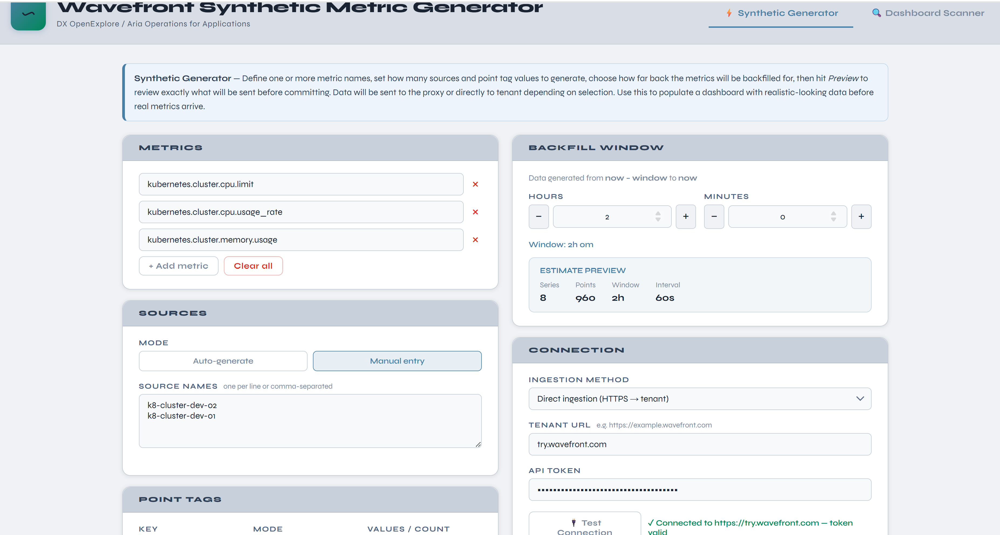
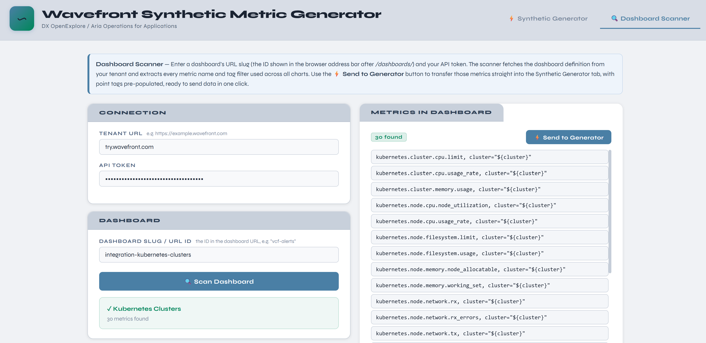

# Wavefront Synthetic Metric Generator

A lightweight web tool for generating and ingesting synthetic metric data into **VMware Aria Operations for Applications** (formerly Tanzu Observability / Wavefront / DX OpenExplore).

Built for platform engineers and SREs who need to populate dashboards with realistic-looking data before real metrics arrive — useful for demos, dashboard development, and testing alert thresholds.


## Screenshots





---

## Features

### ⚡ Synthetic Generator
- Define any number of metric names manually or import them from a dashboard scan
- Auto-generate or manually specify source names and point tag values
- Backfill data as far back as needed (hours + minutes granularity)
- Random-walk value generation so charts look like real telemetry, not white noise
- Live point-count estimate with warnings before you commit
- Preview exactly what will be sent before confirming
- **Direct ingestion** (HTTPS → tenant) capped at 50,000 points per request
- **Proxy ingestion** (TCP → Wavefront proxy) with automatic pacing for large volumes

### 🔍 Dashboard Scanner
- Fetch any dashboard by its URL slug using your API token
- Extracts every metric name and tag filter across all chart queries
- Handles WQL `ts()`, histogram `hs()`, unquoted metric names, regex tag filters, and nested functions (`aliasSource`, `taggify`, etc.)
- One-click transfer to the Generator — metrics and point tags pre-populated
- Click any metric row to copy to clipboard

### Connection
- Test connection button for both direct and proxy modes before sending data
- Settings persisted across page refreshes (localStorage)
- Shared tenant/token across both tabs

---

## Quickstart — Docker (recommended)

Requires [Docker](https://docs.docker.com/get-docker/) and [Docker Compose](https://docs.docker.com/compose/).

```bash
git clone https://github.com/YOUR_USERNAME/wavefront-synthetic.git
cd wavefront-synthetic
docker compose up --build
```

Open **http://localhost:8080** in your browser.

That's it. No Python or Node install required.

---

## Local development

### Backend (Python 3.11+)

```bash
cd backend
pip install -r requirements.txt
python main.py
# API runs on http://localhost:8001
```

### Frontend (Node 18+)

```bash
cd frontend
npm install
npm run dev
# UI runs on http://localhost:5173
```

The Vite dev server proxies `/api` requests to `localhost:8001` automatically.

---

## Configuration

### Frontend environment

Copy `frontend/.env.example` to `frontend/.env` and set:

```env
# Only needed when running the frontend separately and pointing at a remote backend
VITE_API_URL=http://my-backend-host:8001
```

In Docker, leave this blank — nginx handles the proxy internally.

### Backend ports

| Service  | Default port | Change in         |
|----------|-------------|-------------------|
| Backend  | 8001        | `docker-compose.yml` |
| Frontend | 8080        | `docker-compose.yml` |

---

## Usage guide

### Synthetic Generator

1. **Add metrics** — type metric names one per row (e.g. `vcf.cpu.usage`, `tas.rep.ContainerCount`). Use the **Dashboard Scanner** tab to import from a live dashboard.
2. **Sources** — choose Auto-generate (set a count) or Manual entry (paste a list).
3. **Point tags** — add tag keys with either auto-generated or specific values. Tags are fully crossed with sources.
4. **Backfill window** — set how far back to generate data (hours + minutes from now).
5. **Connection** — select Proxy or Direct, fill in the details, and click **Test Connection**.
6. **Preview →** — review the exact metric names, source names, tag values, and point count before sending.
7. **Confirm & Send** — data appears in Wavefront immediately.

**Limits:**
- Direct ingestion: max **50,000 points** per request (enforced server-side)
- Proxy ingestion: no hard limit, but automatically paced (1s pause per 50k points)

### Dashboard Scanner

1. Find your dashboard's URL slug — it's the part after `/dashboards/` in the browser URL bar (e.g. `vcf-alerts`).
2. Enter your tenant URL and API token in the Connection section.
3. Click **Scan Dashboard**.
4. Review the extracted metrics with their full tag shapes.
5. Click **⚡ Send to Generator** to transfer metrics and literal tag values to the Generator tab.

---

## Architecture

```
wavefront-synthetic/
├── backend/
│   ├── main.py          # FastAPI app — all API endpoints + metric parsing
│   ├── requirements.txt
│   └── Dockerfile
├── frontend/
│   ├── src/
│   │   ├── App.jsx      # Full React UI (single file)
│   │   └── main.jsx     # React entry point
│   ├── index.html
│   ├── package.json
│   ├── vite.config.js
│   ├── nginx.conf       # Production nginx config (Docker)
│   └── Dockerfile
├── docker-compose.yml
├── .github/
│   └── workflows/
│       └── ci.yml       # Build & test on every PR
└── README.md
```

### API endpoints

| Method | Path                       | Description                              |
|--------|----------------------------|------------------------------------------|
| GET    | `/api/health`              | Health check                             |
| POST   | `/api/test-connection`     | Test tenant or proxy connectivity        |
| POST   | `/api/synthetic`           | Send synthetic data                      |
| POST   | `/api/synthetic/estimate`  | Estimate point count without sending     |
| POST   | `/api/dashboard/scan`      | Fetch dashboard and extract metrics      |

---

## Supported query formats

The dashboard scanner parses:

| Format | Example |
|--------|---------|
| WQL quoted | `ts("my.metric", source="${host}")` |
| WQL unquoted | `ts(my.metric.name, source=${Foundation})` |
| WQL histogram | `hs(my.histogram.m, source="${host}")` |
| Regex tag filters | `job=/router\|isolated_router.*/` → variable tag |
| OR groups | `(task="login" OR task="push")` → separate entries |
| NOT filters | `AND NOT job="telegraf"` → stripped |
| Nested functions | `aliasSource(taggify(sum(ts(...))))` → drills through |


---

## Contributing

Pull requests welcome. Please:
- Keep backend changes to `backend/main.py` — it's intentionally a single file for simplicity
- Keep frontend changes to `frontend/src/App.jsx`
- Run `npm run build` in `frontend/` and `python -c "import main"` in `backend/` before submitting
- CI checks both on every PR

---

## License

MIT — see [LICENSE](LICENSE).
